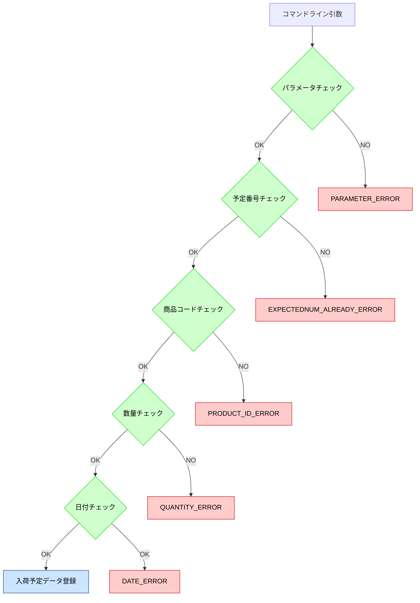

# 概要
商品在庫管理

コマンドライン引数から、入荷予定、入荷、出荷予定、出荷のいずれかを取得しそれに合った処理を実行し、商品の在庫・情報をSQLiteデータベースで管理する。

### 商品マスタ（ProductMaster）
商品の情報を管理するデータになっており、
|項目|ラベル|型|オプション|備考|
|:--|:--|:--|:--|:--|
|商品CD|ProductID|INTEGER|PRIMARY KEY||
|商品名|ProductName|TEXT|NOT NULL||
|状態|Status|INTEGER|DEFAULT0|0:有効、1:無効|
  
で構成される。

### 棚データ（RackData）
上限が100のデータになっており、先に入れたもの出したものから出荷する先入れ先出しで管理する。
1つの棚につき最大100の商品を格納できる。

|項目|ラベル|型|オプション|備考|
|:--|:--|:--|:--|:--|
|棚NO|RackNO|INTEGER|PRIMARY KEY|1~100|
|状態|Status|INTEGER|DEFAULT0|0:空、1:格納|
|商品CD|ProductID|INTEGER|||
|数量|Quantity|INTEGER|DEFAULT0|最大100|
|出庫数|ShippingNum|INTEGER|DEFAULT0||
|入荷日時|InputDT|TEXT||yyyyMMddHHmmss|

### 入荷予定データ（InputPlan）
|項目|ラベル|型|オプション|備考|
|:--|:--|:--|:--|:--|
|予定番号|ExpectedNumb|TEXT|NOT NULL||
|状態|Status|INTEGER|DEFAULT0|0:有効、1:無効|
|商品CD|ProductID|INTEGER|||
|数量|Quantity|INTEGER|DEFAULT0||
|入荷予定日|InputDate|TEXT||yyyyMMdd|

### 出荷予定データ（OutputPlan）
|項目|ラベル|型|オプション|備考|
|:--|:--|:--|:--|:--|
|予定番号|ExpectedNumb|TEXT|NOT NULL||
|状態|Status|INTEGER|DEFAULT0|0:有効、1:無効|
|商品CD|ProductID|INTEGER|||
|数量|Quantity|INTEGER|DEFAULT0||
|出荷予定日|OutputDate|TEXT||yyyyMMdd|
|出庫数|OutputQuantity|INTEGER|DEFAULT0||

### 在庫一覧テーブル（StockList）
|項目|ラベル|型|オプション|備考|
|:--|:--|:--|:--|:--|
|出力キー|OutputKey|TEXT|NOT NULL|yyyyMMddHHmmssSSS|
|商品CD|ProductID|INTEGER|||
|商品名|ProductName|TEXT|||
|数量|Quantity|INTEGER|DEFAULT0||
|入荷予定数|InputPlanNum|INTEGER|DEFAULT0||
|出荷予定数|OutputPlanNum|INTEGER|DEFAULT0||
|引当可能数|AllowableNum|INTEGER|DEFAULT0||

### クラス
- Main: メインクラス
- AllException: 例外処理クラス
- Productmaster: 商品マスタクラス
- RackData: 棚データクラス
- InputPlan: 入荷予定クラス
- Input: 入荷クラス
- OutputPlan: 出荷予定クラス
- Output: 出荷クラス
- StockList: 在庫一覧クラス
- CommandCheck: コマンドライン引数解析クラス
- DateCheck: 日付チェッククラス

## 機能
コマンドライン引数をCommandCheckクラスで解析し、入荷予定、入荷、出荷予定、出荷のどれかを判断する。

### 入荷予定の場合
コマンドライン引数に入荷予定とある場合、必須となる情報（予定番号、商品CD、入荷予定数量、入荷予定日）が指定してあるかをCommandCheckクラスで取得し、情報があれば次に進む。１つでも情報が欠けていたらAllExceptionクラスから例外処理の出力をする。
すべての情報がある場合、予定番号の未登録、商品コードの登録済み、数量、入荷予定日をチェックし、入荷予定データへ登録をする。１つでもチェックが通らなければAllExceptionクラスから例外処理の出力をする。
<!-- 商品マスタから、商品コード、商品名を転記し、棚データから在庫数を集計、入荷予定数を集計する。 -->
|エラー項目|エラーコード文|出力文|発生条件|
|:--|:--|:--|:--|
|パラメータ|PARAMETER_ERROR|パラメータが不足しています。|パラメータが不足している場合|
|予定番号|EXPECTEDNUM_ALREADY_ERROR|予定番号が登録されています。|予定番号が登録されていた場合|
|商品コード|PRODUCT_ID_ERROR|商品コードが登録されていません。|商品コードが未登録の場合|
|数量|QUANTITY_ERROR|数量が正しくありません。|数量が1以下100以上の場合|
|日付|DATE_ERROR|日付が正しくありません。|指定された日付が正しくない場合|

### 出荷予定の場合
コマンドライン引数に出荷予定とある場合、必須となる情報（予定番号、商品CD、出荷予定数量、出荷予定日）が指定してあるかをCommandCheckクラスで取得し、情報があれば次に進む。１つでも情報が欠けていたらAllExceptionクラスから例外処理の出力をする。
すべての情報がある場合、予定番号の未登録、商品コードの登録済み、数量、出荷予定数の引当可能、出荷予定日をチェックし、出荷予定データへ登録する。1つでもチェックが通らなければAllExceptionクラスから例外処理の出力をする。
在庫一覧の出荷予定数を集計、在庫数と出荷予定数から引当可能数を集計する。
|エラー項目|エラーコード文|出力文|発生条件|
|:--|:--|:--|:--|
|パラメータ|PARAMETER_ERROR|パラメータが不足しています。|パラメータが不足している場合|
|予定番号|EXPECTEDNUM_ALREADY_ERROR|予定番号が登録されています。|予約番号が登録されていた場合|
|商品コード|PRODUCT_ID_ERROR|商品コードが登録されていません。|商品コードが未登録の場合|
|数量|QUANTITY_ERROR|数量が正しくありません。|数量が1以下100以上の場合|
|引当可能|ALLOWABLENUM_ERROR|引当可能数が不足しています。|引当可能数が不足している場合|
|日付|DATE_ERROR|日付が正しくありません。|指定された日付が正しくない場合|

### 入庫の場合
コマンドライン引数で、入荷予定番号を指定して処理を実行する。入荷予定データが登録されているか、未入庫であるか、空いている棚があるかをチェックし、空いている棚に商品データの登録、入荷予定データを入庫済みに更新する。１つでもチェックが通らなければAllExceptionクラスから例外処理の出力をする。入荷予定データを入庫済みに更新する。
|エラー項目|エラーコード文|出力文|発生条件|
|:--|:--|:--|:--|
|パラメータ不足|PARAMETER_ERROR|パラメータが不足しています。|パラメータが不足している場合|
|予定番号未登録|EXPECTEDNUM_NOT_FOUND_ERROR|予定番号が登録されていません。|指定された予定番号が未登録の場合|
|入荷予定データ未登録|INPUT_NODATA_ERROR|入荷予定データが登録されていません。|入荷予定データが登録されていない場合|
|入庫済み|ALREADY_STOCK_ERROR|入庫済みです。|入庫済みの場合|
|空き棚不足|RACK_ERROR|棚が空いていません。|空き棚が不足している場合|

### 出庫の場合
コマンドライン引数で、出荷予定番号を指定して処理を実行する。出荷予定データが登録されているか、未出庫であるか、棚データに登録されている在庫数で出荷可能かチェックし出荷し、棚データの出庫数を更新、出荷予定データを出庫済みに更新する。１つでもチェックが通らなければAllExceptionクラスから例外処理の出力をする。
在庫数は、格納数から出庫数を引いた数で算出する。棚データから商品データがなくなったら棚を空にする。
|エラー項目|エラーコード文|出力文|発生条件|
|:--|:--|:--|:--|
|パラメータ不足|PARAMETER_ERROR|パラメータが不足しています。|パラメータが不足している場合|
|予定番号未登録|EXPECTEDNUM_NOT_FOUND_ERROR|予定番号が登録されていません。|指定された予定番号が未登録の場合|
|出荷予定データ未登録|OUTPUT_NODATA_ERROR|出荷予定データが登録されていません。|出荷予定データが未登録の場合|
|出庫済み|ALREADY_SHIPPED_ERROR|出庫済みです。|出庫済みの場合|
|在庫不足|STOCK_ERROR|在庫が不足しています。|在庫が不足している場合|

### 例外処理項目
|エラー項目|エラーコード文|出力文|発生条件|
|:--|:--|:--|:--|
|パラメータ不足|PARAMETER_ERROR|パラメータが不足しています。|パラメータが不足している場合|
|予定番号登録済み|EXPECTEDNUM_ALREADY_ERROR|予定番号が登録されています。|予定番号が登録済みの場合|
|予定番号未登録|EXPECTEDNUM_NOT_FOUND_ERROR|予定番号が登録されていません。|指定された予定番号が未登録の場合|
|引当可能数不足|ALLOWABLENUM_ERROR|引当可能数が不足しています。|引当可能数が不足している場合|
|空き棚不足|RACK_ERROR|棚が空いていません。|空き棚が不足している場合|
|在庫不足|STOCK_ERROR|在庫が不足しています。|在庫が不足している場合|
|日付|DATE_ERROR|日付が正しくありません。|指定された日付が正しくない場合|
|商品コード|PRODUCT_ID_ERROR|商品コードが登録されていません。|商品コードが未登録の場合|
|数量|QUANTITY_ERROR|数量が正しくありません。|数量が1以下100以上の場合|
|入荷予定データ未登録|INPUT_NODATA_ERROR|入荷予定データが登録されていません。|入荷予定データが未登録の場合|
|出荷予定データ未登録|OUTPUT_NODATA_ERROR|出荷予定データが登録されていません。|出荷予定データが未登録の場合|
|入庫済み|ALREADY_STOCK_ERROR|入庫済みです。|入庫済みの場合|
|出庫済み|ALREADY_SHIPPED_ERROR|出庫済みです。|出庫済みの場合|
|入荷予定登録失敗|INPUT_PLAN_ERROR|入荷予定データの登録に失敗しました。|入荷予定データ登録に失敗した場合|
|出荷予定登録失敗|OUTPUT_PLAN_ERROR|出荷予定データの登録に失敗しました。|出荷予定データ登録に失敗した場合|
|入庫失敗|INPUT_ERROR|入庫に失敗しました。|入庫に失敗した場合|
|出庫失敗|OUTPUT_ERROR|出庫に失敗しました。|出庫に失敗した場合|

<!-- ## 流れ
CommandCheckクラスでコマンドライン引数を取得し、入荷予定、入荷、出荷予定、出荷を判断する。それに続く指定された情報の引数をInputPlan、Input、OutputPlan、Outputの各クラスに通知する。指定すべき引数や、指定された予約番号が登録されてないときはAllExceptionクラスから例外処理の出力文を出力する。通知を受け取った各クラスで、予定番号の未登録や商品コードの登録済みチェックを行う。出荷予定データ登録時に引当可能数が足りない場合、入荷時に棚に空きが無い場合、出荷時に在庫が不足している場合は、AllExceptionクラスから例外処理の出力文を出力する。DateCheckクラスで、入荷予定日と出荷予定日のフォーマットが正しいか確認し、エラー文出力もしくは次に進む。すべてのチェックが通った場合は、それぞれのデータを更新する。 -->

